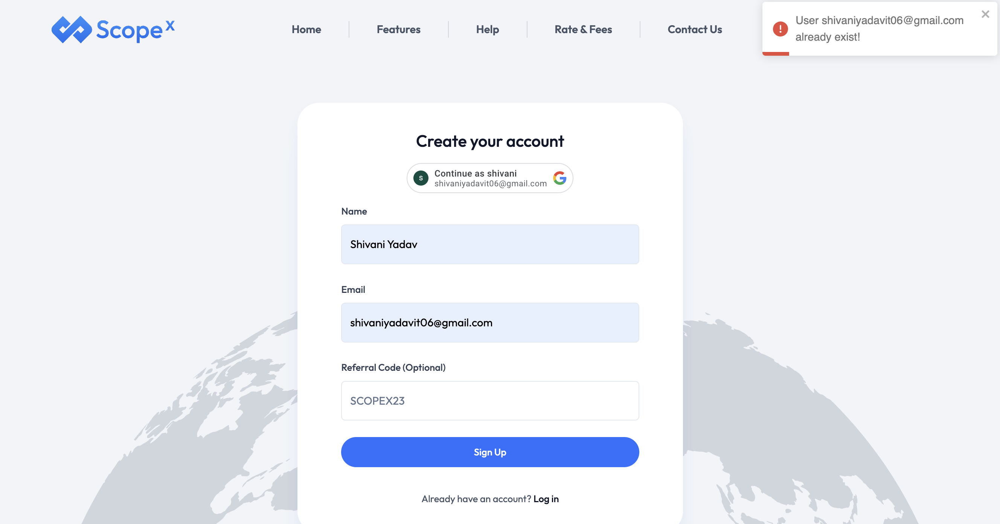

# Manual Test Cases for user Signup

### **Test Case ID:** TC001  
### **Title:** Verify User Signup Functionality  
#### **Description:** Check if a user can signup with email.

### **Preconditions:**
- The user must not be registered.
- The signup page must be accessible.

### Test Steps:
1. Open the application.
2. Navigate to the signup page.
3. Enter valid Name and Email id.
4. Click "Sign Up".

**Expected Result:**
- The user should be redirected to the dashboard.

**Actual Result:**
- ✅ *Pass* (Screenshot below)

### Screenshot:

 

### **Test Case ID:** TC002
### **Title:** Verify error message when trying to sign up with an existing user account Functionality

---
#### **Description:** This test case verifies that the system prevents a user from signing up using an already registered email and displays the correct error message.

### **Preconditions:**
- The email **shivaniyadavit06@gmail.com** is already registered in the system.
- The sign-up page is accessible.

---

## **Test Steps:**

| Step No. | Action                                                                    | Expected Result |
|----------|---------------------------------------------------------------------------|----------------|
| 1 | Open the application and navigate to the sign-up page.                    | The sign-up page should load successfully. |
| 2 | Enter an already registered email (e.g., **shivaniyadavit06@gmail.com**). | The email field should accept input. |
| 3 | Fill in other details (name, email id) and click the **Sign Up** button.  | The system should process the request. |
| 4 | Check the displayed message.                                              | The system should display: **"User shivaniyadavit06@gmail.com already exist"** |
| 5 | Verify that the user remains on the sign-up page and is not redirected.   | The user should not be taken to the dashboard or login page. |

---

## **Expected Result:**
- The system should display an error message:  
  **"User shivaniyadavit06@gmail.com already exist"**
- The user should **not** be allowed to sign up again.

**Actual Result:**
- ✅ *Pass* (Screenshot below)

### Screenshot:

# Manual Test Case - Invalid Email Validation on Sign-Up Page

## **Test Case ID:** TC004
**Title:** Verify email validation during user sign-up

---

## **Description:**
This test case checks whether the system validates the email format correctly during user sign-up. The system should not allow sign-up without verifying if the email format is valid.

## **Preconditions:**
- The sign-up page is accessible.

---

## **Test Steps:**

| Step No. | Action | Expected Result |
|----------|--------|----------------|
| 1 | Open the application and navigate to the sign-up page. | The sign-up page should load successfully. |
| 2 | Enter **name:** `fakjfbkajf` | The username field should accept input. |
| 3 | Enter **email ID:** `fjkahfkjhakjfh@gmail.com` (A valid Gmail format) | The email field should validate that it contains '@gmail.com'. |
| 4 | Click on the **Sign Up** button without verifying the email ID. | The system should not allow sign-up and should prompt for email verification. |
| 5 | Check the displayed message. | The system should display: **"Please verify your email before signing up."** |
| 6 | If sign-up is successful without verification, note the issue. | The system should not allow account creation without verification. |

---

## **Expected Result:**
- The system should check that the email contains **"@gmail.com"**.
- The system should **require** email verification before completing sign-up.
- If the user clicks **Sign Up** without verifying the email, an error message should be displayed:  
  **"Please verify your email before signing up."**

## **Actual Result:**
(To be filled after execution)

## **Status:**
✅ Pass / ❌ Fail

## **Priority:**
**High** (Since incorrect email validation can allow fake sign-ups)

## **Screenshot:**

# Manual Test Case - Adding a Recipient Successfully

## **Test Case ID:** TC001
**Title:** Verify successful recipient addition with all mandatory fields filled

---

## **Description:**
This test case verifies that the user can successfully add a recipient by filling in all mandatory fields, submitting the form, receiving a confirmation message, and having ₹1 credited for verification.

## **Preconditions:**
- The **"Add Recipient"** page is accessible.
- The user has a valid bank account.
- ₹1 test transaction is supported for verification.

---

## **Test Steps:**

| Step No. | Action | Expected Result |
|----------|--------|----------------|
| 1 | Open the application and navigate to the **Add Recipient** page. | The recipient form should be displayed. |
| 2 | Enter **Recipient Name:** `Shivani Yadav` | The name field should accept input. |
| 3 | Enter **Recipient Nickname:** `Shivani` | The nickname field should accept input. |
| 4 | Enter **Bank Account Number:** `368999` | The account number field should accept input. |
| 5 | Enter **IFSC Code:** `SBI18299` | The IFSC code field should accept input. |
| 6 | Select **Country:** `India` | The dropdown should allow selecting the country. |
| 7 | Click on the **Submit** button. | The system should process the request. |
| 8 | Check the confirmation message displayed. | The system should display: **"Recipient added successfully."** |
| 9 | Verify if ₹1 is credited to the recipient's bank account. | The system should confirm **₹1 credited successfully for verification.** |

---

## **Expected Result:**
- The system should accept all mandatory fields.
- The system should **display a confirmation message** after submission:  
  **"Recipient added successfully."**
- The system should **credit ₹1 to the recipient's account for verification.**

## **Actual Result:**
(To be filled after execution)

## **Status:**
✅ Pass / ❌ Fail

## **Priority:**
**High** (Since recipient addition must be seamless and verified correctly)

## **Screenshot:**

# Manual Test Case - System Accepting Incorrect Name & IFSC but Crediting ₹1

## **Test Case ID:** TC008
**Title:** Verify if the system incorrectly credits ₹1 despite a mismatched name and IFSC code

---

## **Description:**
This test case checks if the system **incorrectly processes recipient addition** even when the **name and IFSC code are changed**, while keeping the same account number. The test validates whether the system still **shows the confirmation popup and credits ₹1 to the recipient**, which should not happen.

## **Preconditions:**
- The **"Add Recipient"** page is accessible.
- The recipient **must already exist** with the correct details.
- The system should strictly validate the **name and IFSC code** before crediting any amount.

---

## **Test Steps:**

| Step No. | Action | Expected Result |
|----------|--------|----------------|
| 1 | Open the application and navigate to the **Add Recipient** page. | The recipient form should be displayed. |
| 2 | Enter **Recipient Name:** `Shivani Yadvkshshs` (Modified) | The system should validate and reject incorrect names. |
| 3 | Enter **Recipient Nickname:** `Shivani` | The nickname field should accept input. |
| 4 | Enter **Bank Account Number:** `368999` (Same as before) | The account number field should accept input. |
| 5 | Enter **IFSC Code:** `SBIN0010538` (Modified) | The system should validate the IFSC and reject invalid values. |
| 6 | Select **Country:** `India` | The dropdown should allow selecting the country. |
| 7 | Click on the **Submit** button. | The system should prevent submission due to mismatched details. |
| 8 | Observe the **confirmation popup** displayed. | The system should **not** show a confirmation popup for incorrect details. |
| 9 | Check if ₹1 is credited despite incorrect details. | The system should **not credit ₹1** to an unverified recipient. |

---

## **Expected Result:**
- The system should **validate the name and IFSC before processing the transaction**.
- If the name or IFSC **does not match the actual account details**, the system should **reject** the request.
- An error message should be displayed instead of a confirmation popup:  
  **"Recipient details do not match the bank records. Please enter the correct name and IFSC code."**
- **₹1 should NOT be credited** unless all details match the bank’s records.

## **Actual Result:**

 Rs 1 is credit and confirmation giving account is valid.

## **Status:**
✅ Pass / ❌ Fail

## **Priority:**
**Critical** (Since incorrect details are being accepted, leading to a potential security and financial issue)

## **Screenshot:**
  

# Manual Test Case - Verify Logout Functionality

## **Test Case ID:** TC009
**Title:** Verify user logout and redirection to home page

---

## **Description:**
This test case verifies that when a user clicks the **Logout** button, the system logs them out successfully and redirects them to the home page.

## **Preconditions:**
- The user must be **logged into the application**.
- The **Logout** button must be visible and accessible.

---

## **Test Steps:**

| Step No. | Action | Expected Result |
|----------|--------|----------------|
| 1 | Open the application and log in with valid credentials. | The user should be logged in and redirected to the dashboard. |
| 2 | Locate the **Logout** button in the navigation menu. | The Logout button should be visible. |
| 3 | Click on the **Logout** button. | The system should process the logout request. |
| 4 | Observe the redirection after logout. | The system should redirect the user to the **home page**. |
| 5 | Try accessing a restricted page (e.g., Dashboard) after logout. | The system should prevent access and redirect back to the login page. |

---

## **Expected Result:**
- The system should **log out the user successfully**.
- The user should be **redirected to the login page**.
- Any attempt to access a restricted page after logout should **redirect to the login page**.

## **Actual Result:**
The user is **redirected to the home page**.

## **Status:**
✅ Pass / ❌ Fail

## **Priority:**
**High** (Since logout is a critical security feature)

## **Screenshot:**
  

